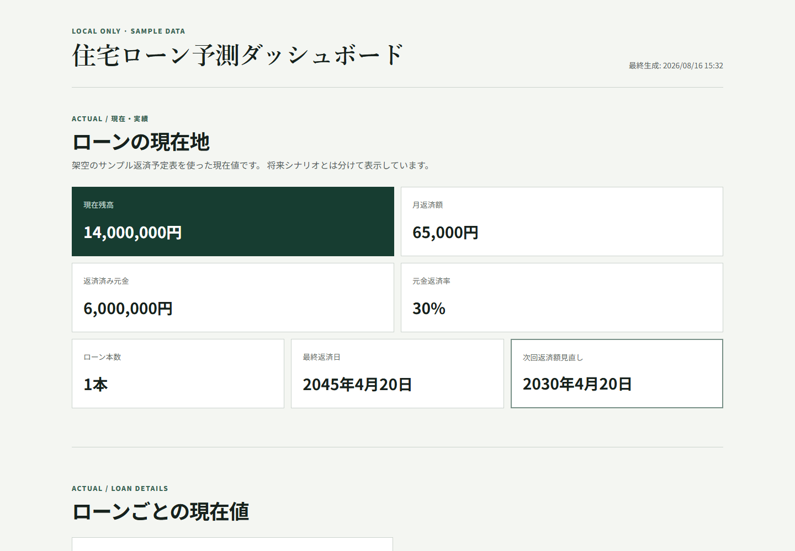

# Mortgage Forecast

変動金利住宅ローンの返済推移と金利シナリオを、ローカルまたはセルフホスト環境で確認するための
local-firstダッシュボードです。Python計算エンジンとReactダッシュボードを分離し、画面は
生成済み `forecast.json` だけを表示します。

この公開repositoryに含まれる住宅ローンデータは、実在の契約と関係のない人工sampleです。

> **Status: pre-release / experimental.** 個別商品の実績検証なしに、銀行商品全般へ適用できる
> 安定版とは位置付けていません。

## 画面イメージ



実在の契約とは関係のない、公開repository内の人工sampleから生成した画面です。

## 重要な免責

このprojectは金融アドバイスを提供せず、将来金利を予測・保証しません。金融判断を自動化する
ものでも、銀行の正式な返済予定表を置き換えるものでもありません。金融機関の商品仕様変更へ
追従する保証はありません。

このprojectでは、計算式が一般論として正しいことだけでなく、**利用者自身の銀行返済予定表・
返済実績をgolden dataとして検証すること**を推奨します。設定可能であることと、実績で検証済み
であることは同じではありません。

## Sample dataで起動

Python 3.13以降とNode.jsを使用します。

```bash
python -m venv .venv
source .venv/bin/activate
python -m pip install -r requirements.txt
cd dashboard && npm install && cd ..
python scripts/dev.py
```

Windows PowerShellではvirtual environmentを `.venv\Scripts\Activate.ps1` で有効化します。
通常はブラウザで `http://127.0.0.1:5173` を開きます。

初回install後は、普段の起動・更新は次の1コマンドです。

```bash
python scripts/dev.py
```

`sample-data/` のYAMLやCSVを保存すると、`forecast.json` を自動再生成し、Viteが画面を更新します。
Python・React sourceの変更もViteが反映します。停止は `Ctrl+C` です。

## Private dataを使う

実データは公開repoの外に置きます。推奨構成とprivacy上の注意は
[`docs/private-data-repo.md`](docs/private-data-repo.md) と
[`examples/private-data-template/`](examples/private-data-template/) を参照してください。

macOS / Linux / WSL:

```bash
export MORTGAGE_DATA_DIR=../mortgage-forecast-private/data
python scripts/dev.py
```

Windows PowerShell:

```powershell
$env:MORTGAGE_DATA_DIR="..\mortgage-forecast-private\data"
python scripts/dev.py
```

CLI optionは環境変数より優先されます。

```bash
python scripts/dev.py --data-dir ../mortgage-forecast-private/data
```

JSON生成だけを行う従来の `scripts/generate_forecast.py` も、CIや自動処理向けに維持しています。

データrootの優先順位は `--data-dir`、`MORTGAGE_DATA_DIR`、`sample-data/` です。明示した
外部dataに不足や形式不正がある場合、sampleへsilent fallbackせず、対象ファイルを示して終了します。

## Data schema

data rootは次の構成です。

```text
data-schema.yaml
loans/*.yaml
actual/*.csv
rates/actual-rates.yaml
rates/scenarios.yaml
sources.yaml
```

`data-schema.yaml` の `data_schema_version` は現在 `1.0` です。data schemaは将来変更される
可能性があります。required file、YAML、loan ID、重複ID、actual CSV列を生成前に検証します。
外部data rootの絶対pathは、生成する `forecast.json` に記録しません。

残高推移・月返済額推移をグラフではなく表だけで表示する場合は、private data側の
`data-schema.yaml`に次を設定します。省略時は`true`です。

```yaml
dashboard:
  show_trend_charts: false
```

## 初期データと更新方法

実データで利用するには、契約値、現在残高・金利・返済額、銀行返済明細、実金利履歴、将来scenario
をprivate data directoryへ入力します。必要な資料、全項目の意味、初回入力、月次更新、金利変更、
返済額見直しの手順は [`docs/data-setup-and-updates.md`](docs/data-setup-and-updates.md) にまとめています。

日常の更新は、起動中ならprivate YAML / CSVを保存するだけです。`scripts/dev.py` が
`forecast.json` を再生成し、画面へ反映します。

## 現在の対応範囲

主に次の特徴を持つ住宅ローンを対象としています。

- 変動金利
- 元利均等返済
- 返済額を一定期間固定し、一定期間ごとに見直す方式
- 見直し後返済額の上限ルール
- 未払利息の繰越と返済充当
- 満期時の残元金・未払利息と最終返済額の表示
- ローン別に設定した金利path、短期プライムレートspread、見直し日程
- ローン別に設定可能な付利残高単位

現時点で最も実績検証が進んでいるのは、日本の変動金利型住宅ローンで一般的に見られる、
短期プライムレート等に連動する金利、元利均等返済、5年ごとの返済額見直し、見直し後返済額の
125%上限に相当するルールを組み合わせた方式です。計算エンジンは特定の金融機関・商品専用
ではありません。

ただし、変動金利・元利均等返済でも、5年ごとの見直しや125%上限を採用しない商品があります。
金利・返済額の見直し基準日、金利の適用境界、一部繰上返済後の再計算、端数処理、未払利息の
精算方法も商品ごとに異なり得るため、利用前に契約規定と実際の返済予定表で検証してください。

付利残高100円単位は、特定の銀行返済予定表を再現するために実績から推定した `inferred` 設定の
一例であり、汎用ルールではありません。data configで変更できます。

## 未対応または十分に検証されていない方式

- 固定金利ローン、全期間固定金利
- 元金均等返済
- ボーナス返済
- 現在の実装と異なる返済額見直しルール
- 定期的な返済額見直しがない商品
- 125%上限がない、または上限計算が異なる商品
- 金融機関固有の特殊な利息期間・端数処理
- すべての海外mortgage product

設定可能であることは、個別商品で検証済みであることを意味しません。一般化されていない銀行固有
ルールは、推測で抽象化せず `unverified` として残しています。

## Verification metadata

公開JSONでは根拠を `actual`、`contractual`、`official_product_rule`、`inferred`、
`scenario`、`unverified` で区別します。Golden testの0円一致は取得済み実績の再現結果であり、
将来シナリオの正確さを意味しません。

## Tests

公開repoのunit、人工golden、generic rule tests:

```bash
pytest
```

private dataがない環境ではprivate actual testは正常にskipします。外部実績も含める場合:

```bash
MORTGAGE_DATA_DIR=../mortgage-forecast-private/data pytest -m private_actual
```

React側:

```bash
cd dashboard
npm test
npm run typecheck
npm run lint
npm run build
```

自動axeテストの違反0件はWCAG 2.2 AAへの完全な適合を保証しません。手動確認項目は
[`docs/accessibility-test.md`](docs/accessibility-test.md) にあります。

## Security / Privacy

このprojectは個人の金融データを扱います。

- public repositoryへ実データをcommitしない
- 氏名、住所、口座番号、支店番号などを保存しない
- 元の銀行PDFや画面キャプチャをcommitしない
- `forecast.json` も残高・返済額を含むprivate情報として扱う
- 実データは別のprivate repositoryで管理する
- local-firstまたは管理下のself-host環境を優先する

作者が運営する中央データサービスへ住宅ローン情報を送信する設計ではありません。生成される
`dashboard/public/generated/forecast.json` は残高、返済額、金利、返済日などを含み得る生成データ
であり、機微な金融情報として扱ってください。このファイルはGit管理対象外です。

**公開前にGit履歴に個人データが残っていないことを必ず確認してください。** 過去に実データを
commitした可能性がある場合、公開前に別工程で履歴clean-upと再scanが必要です。

### Threat model / Privacy model

| 想定リスク | 現在の対策 |
|---|---|
| 実データやsecretのpublic commit | private external data directory、`.gitignore`、sample-only public tests |
| 生成forecastの漏えい | `forecast.json` を非追跡化し、private情報であることを明示 |
| 銀行PDF・画面キャプチャの漏えい | repositoryへ保存しない運用とprivate templateのignore設定 |
| 認証なしのpublic deployment | 現在はlocalhost限定・local-first。将来公開する場合は認証を必須化 |
| browser cacheやlocal machineの侵害 | 信頼できる端末でのみ生成・閲覧し、端末とbrowser profileを保護 |

このモデルはlocal machine自体の侵害を防ぐものではありません。public deployment、認証、uploadを
追加する場合は、新たなthreat modelとsecurity reviewが必要です。

## Dependencyと再現性

- Pythonは `requirements.txt` の直接依存をversion固定して使用します。transitive dependencyを
  hash付きで完全lockする方式は未導入です。
- npmは `dashboard/package-lock.json` を正とし、CIでは `npm ci` を使用します。
- Python package metadataは `pyproject.toml`、開発・実行環境の導入一覧は
  `requirements.txt` で管理します。

## Contributing / Security / CI

- Contribution時のprivacy・検証ルール: [`CONTRIBUTING.md`](CONTRIBUTING.md)
- 脆弱性やfinancial data exposureの報告方針: [`SECURITY.md`](SECURITY.md)
- Public CI: [`.github/workflows/ci.yml`](.github/workflows/ci.yml)

CIはprivate dataを使わず、sample forecast生成、JSON Schemaを含むPython tests、React tests、axe、
TypeScript、lint、production buildを実行します。forecastをartifactとしてuploadしません。

通常のproduction buildはsample forecastだけを許可します。external forecastを含むbuildは公開用では
ありません。ローカルまたは認証済み環境で扱うことを確認した場合に限り、明示的なacknowledgement
を設定できます。

```bash
MORTGAGE_ALLOW_EXTERNAL_BUILD=I_UNDERSTAND npm run build
```

## Repository構成

```text
mortgage/       Python計算エンジン
dashboard/      React / TypeScript / Vite
sample-data/    実在契約と無関係な人工データ
schemas/        forecast JSON Schema
tests/          public testsとoptional private test hook
docs/           data分離・アクセシビリティ文書
```

Cloudflare Worker、D1、R2、外部認証、PDF upload、MCPは現在提供していません。

## License

このprojectは [MIT License](LICENSE) で公開します。
